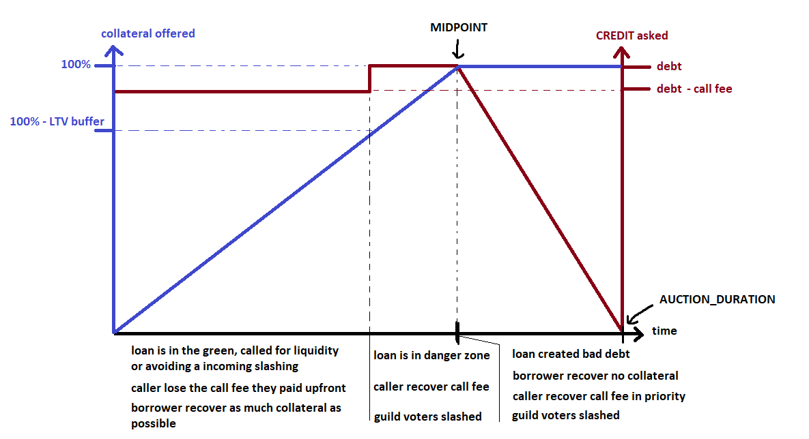

# Ethereum Credit Guild

The Ethereum Credit Guild is a system for lending, borrowing, and trading cryptoassets based on the following principles:
* immutable code
* no trusted third parties (especially oracles)
* market-based governance
* checks and balances

Accomplishing these goals requires a very different approach from other credit markets on Ethereum, and the architecture of the ECG reflects that. Its core primitive is the **callable loan**, where borrowers can use an immutable set of lending terms that they find acceptable, and there is a defined cost of liquidity to the lender. There are mechanisms by which lending terms can be onboarded or offboarded, but the code defining lending and borrowing rules cannot be changed. Once a borrower has initiated a loan, nothing about it can be changed. To close the loan before the borrower wants to repay, the lender must pay the call fee.

The ECG is governed by the **GUILD** holders, who cannot change the protocol code in any way, but can submit new lending terms and vote in the gauges to allocate the debt ceiling. Anything a GUILD holder can do to change the system, there is also a way to veto. This means that instead of being vulnerable to a 51% attack, the ECG has an honest minority assumption. In the worst case of an unresolvable dispute where a minority vetoes any new lending terms, users would be forced to fork the protocol, but no funds would be at risk.

Unlike other modes of token governance, GUILD holders earn (or lose) based on their own performance, accruing part of the yield from whatever loan they are voting for in the gauges, and being subject to liquidation penalties in the event of poor loan performance.

Any scaling solution pursued by the ECG must be immutable and trustless like the ECG itself. This excludes upgradeable rollups and encourages the use of a simpler, application specific scaling implementation. We use a model called a "hyperoptimistic rollapp" to allow ECG users to transact at low costs by refraining from posting state updates to Ethereum as calldata. Only the state root is posted to mainnet, meaning there is a fixed mainnet cost per rollup state transition regardless of how many users there are.

Unifying L2 and mainnet in design allow for interesting possibilities such as a trustless fast bridge through overcollateralization. As an alternative to waiting for the challenge period to withdraw a particular asset from L2, a user can instead enter a collateralized position by depositing a greater value of a different asset. This can be considered a generalized replacement for fast bridges, where instead of needing both a bridge operator and liquidity providers for the bridge-tokens, a user only needs to trust the liquidity provider's collateral. The result is greatly reduced spreads between rollup assets and mainnet equivalents, which may be significant due to rollup challenge periods.

- [Ethereum Credit Guild](#ethereum-credit-guild)
  - [Architecture Overview](#architecture-overview)
  - [Mechanism Detail](#mechanism-detail)
    - [Borrowing](#borrowing)
    - [Calling and Liquidating Loans](#calling-and-liquidating-loans)
    - [Handling Bad Debt](#handling-bad-debt)
    - [Swaps](#swaps)
    - [Bonds](#bonds)
    - [GUILD Minting and Redemption](#guild-minting-and-redemption)

## Architecture Overview

The Ethereum Credit Guild exists on both mainnet and as a layer two. The architecture consists of the following mainnet contracts:

* the set of approved lending terms, each of which is an instance of the same smart contract
* the gauges which define the debt ceilings for the lending terms
* the `CREDIT` token, which is the native debt asset, and others like it such as `CREDIT_ETH`
* the `GUILD` token which can vote in the gauges and earn interest
* the AuctionHouse which handles liquidations
* the governance module which is used to whitelist new lending terms
* the veto module which is used to veto proposed lending terms, or offboard existing ones
* the ProposerHub which has the logic for:
  * proposer selection
  * computing and storing state roots
  * challenges/interactive fraud proofs

Mainnet and layer two have independent state, such as:

* the available lending terms
* the in-flight proposals for new lending terms
* current gauge votes + voter positions
* per-lending term available debt (determined by gauge votes, minus debt issued)
* global CREDIT debt ceiling (aka, gauge vote weight)
* current borrower positions

There is one critical piece of state which is shared, the debt discount rate. If bad debt occurs due to a failed liquidation, the debt discount rate marks down the loss globally, and is a mainnet variable that is referenced by L2 and must be updated by the proposer if a bad debt auction concludes on L2. Hopefully, this will be rare, and thus not impose any meaningful gas cost to the proposer.

All of the above is immutable at the code level. The riskiest operation that can occur is defining a new lending term with a new collateral asset. This and any other changes are subject to veto by GUILD holders. 

## Mechanism Detail

### Borrowing

A `LendingTerm` is a blueprint for a loan. The key parameters of a callable loan are:

* collateral token
* debt token
* borrow ratio
* interest rate
* call fee
* call period

A given user's position includes the following state:

* origination time
* debt balance
* call time (zero means it has yet to be called)

Some of these are self explanatory. The ECG does not use any trusted oracles, so callable loans are denominated in unit terms, not in price terms. The borrow ratio is how many debt tokens are borrowable per collateral token. The interest rate is expressed in terms of debt tokens percent annual. Without a trusted oracle, we need a way to prevent borrowers from being griefed by lenders, but also allow lenders to access liquidity on demand.

The call fee is like a bond paid by the lender to replace the need for a trusted oracle. The call period is how long the borrower has to repay their loan before liquidation starts. If the borrower repays during the call period, the call fee is deducted from their debt and burnt. Otherwise, their collateral will go to auction. If the borrower's loan is revealed by the auction to be in the danger zone, the caller is reimbursed the call fee.

As a borrower, the call fee represents compensation for the inconvenience of needing to repay your loan if there is a drawdown in demand to hold CREDIT or one of the protocol's other debt tokens. By choosing an appropriate call fee and call period for their needs, borrowers can take leverage against a wide range of collateral types. 

To initiate a loan, a user must find an acceptable set of lending terms and post collateral. For mainnet borrowers, the collateral tokens are held in the associated `LendingTerm` contract while the loan is active. For borrowers on layer two, their tokens are held by the ProposerHub. 

When a user repays their loan, they must repay a greater amount of credits than they borrowed due to the accrued interest. Of the repaid credits, the entire principal is burnt, while the interest is partially burnt, and partially distributed to the gauge contract where it is claimable by the GUILD holders voting for that loan. The portion of the interest burnt is a global governable parameter. Anyone can repay a loan, though only the user can withdraw their collateral.

--------------

### Calling and Liquidating Loans

Anyone can call a loan issued by the protocol by paying the call fee, as described above. If the borrower does not repay, their collateral will be seized by the auction house referenced in their lending term. Each lending term references an auction house as one of its parameters. A new auction house contract can be deployed and referenced by future lending terms if necessary.

The basic auction house conducts a Dutch auction where a gradually larger portion of the borrower's collateral is offered in exchange for repaying their debt. If the borrower's entire collateral is not enough to pay their debt, a partial payment is accepted. The goal in the implementation is that with each block, the change in the discount applied to the collateral or debt should not be too much, but also, the auction should not be too long either. The auction house adopts a target of 10m auctions which translates to a 2% discount per block in a naive implementation. To provide better granularity, we can frontload the auction such that not only the discount, but the rate of change of the discount, increases over time. The resulting behavior will be fishing for as small a loss for the borrower as possible, but quickly backing down if there is no bid to preserve the lender capital.

-------------

### Handling Bad Debt

Existing decentralized finance protocols like Aave, Compound, or MakerDAO lack mechanisms to swiftly mark down bad debt and prevent bank runs. Users who withdraw (in the case of Aave or Compound) or redeem via the Peg Stability Module (in the case of MakerDAO) can avoid any loss, while those who are too slow risk a 100% loss.

We mitigate this risk by eliminating atomic, on demand withdrawals, in favor of the mechanic of callable loans. Loans will have a call period during which the borrower can repay. A loan may have a call period of zero to simulate the function of a PSM or Compound pool, but since liquidation occurs by auction, it will still set a market price instead of allowing some users to redeem above peg after a loss has occurred.

This alone does not solve bank run risk, as when partial repayment is accepted in a liquidation auction, there are more credits in circulation compared to the amount of credit owed as debt, and so the 'leftover' credits are worthless if all the loans are called or repaid. This is addressed by separately tracking the circulating credit supply, and the total credits issued as debt. When the ratio is not 1:1, the amount of credits minted against collateral or required to repay debts is adjusted accordingly, via the **debt discount rate**. If bad debt occurs on L2, the proposer must adjust the L1 debt discount rate as part of that state update. The result is that if the entire protocol is unwound, every credit must be used to repay the outstanding loans, and more credits can be issued against the same collateral proportional to the bad debt. The above is true for each credit denomination, meaning bad debt in one denomination will be transparently marked down and legibile throughout the protocol as a whole.

It is still possible that sophisticated actors could observe an in-progress liquidation auction, judge it likely to fail, and act to sell their tokens before others, but even so they can't drain a PSM at 1:1. Wise market makets would do well to widen their spreads under such circumstances.

-------------

### Swaps

A "swap" is a special variant on a `LendingTerm` that has the following properties:

* `callFee == 0`
* `callPeriod == 0`
* `interestRate == 0`

A swap is the "callable loan" replacement for a Peg Stability Module as seen in MakerDAO, Fei Protocol, or Volt Protocol. The main difference is that while minting of the "borrow token" is on demand, redemption is by auction, the same as any other callable loan. As discussed [above](#handling-bad-debt), this is to prevent runs in the event of bad debt, as well as adverse selection in the event that a collateral rises in price after the swap terms are set.

Unlike a regular loan, after the auction is complete, any remaining collateral is retained by the protocol. `GUILD` holders can vote to allocate exogenous assets obtained through swaps into new swap terms, or allocate credit limits as in the usual callable loans mechanism.

-------------

### Bonds

A "bond" is a variant on a `LendingTerm` where the protocol is the borrower.

Users stake `CREDIT` in a gauge, the same as voting with `GUILD`, to vote for a `BondTerm` and increase its debt ceiling. `GUILD` holders can then vote for a composite lending strategy combining a bond and lending term. Bonds are intended primarily to allow the protocol to price duration. Users will be able to lock their `CREDIT` and accept a longer call period or higher call fee to obtain more yield, and market forces can create a yield curve in the protocol.

-------------

### GUILD Minting and Redemption

The `GUILD` governance token can use the same mechanisms as the `CREDIT` token for its issuance and redemption. Existing `GUILD` holders can vote on a global debt ceiling, and then stake in gauges to allocate this debt ceiling among various collateral tokens and into swaps. This allows a market based process to distribute or accumulate surplus capital, instead of the simplistic automated buyback or mint mechanisms seen in MakerDAO that have demonstrated poor performance[^1].

[^1]: A New Mental Model for DeFi Treasuries. Hasu. https://uncommoncore.co/a-new-mental-model-for-defi-treasuries/

[^2]: Primer: Money Market Funds and the Repo Market. Viktoria Baklanova, Isaac Kuznits, Trevor Tatum. https://www.sec.gov/files/mmfs-and-the-repo-market-021721.pdf